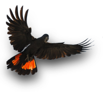

{.center}

# Kalamunda Districts Ratepayers &  Residents Association (Inc)
### Minutes (Annual General Meeting) Falls Farm, 41 Cagney Way Lesmurdie Thursday 15 July 2021 Meeting Opened: 7.12pm

#### Attendees:

Nat Coppin; Gail Evans; Andrea Balfe; Bev Dornan; John Edmonds; Pauline Tonkin; Greg Schofield.

#### Apologies:
Ron Davey.

#### Membership:
Andrea Balfe reported that the Association had 10 financial members. Tim Comber advised that Meri Comber has resigned.

Motion to accept Membership of Greg Schofield; Bev Dornan; Ron Davey

Mover: Gail Evans  
Seconded: Nat Coppin    
_Motion Supported_

#### Financial Report:
Andrea Balfe, Treasurer reported:   
* That the current balance was $2,627.30, not including monies received on the night;    
* That she had received a request for reimbursement of receipted expenditure from Peter Forrest amounting to $418.74

General discussion of Reimbursement Request ensued. Consensus was that the requested reimbursement is not approved.

  
Motion movers to bank monies received at the meeting and to cease all outgoings until the next AGM.

Mover: Pauline Tonkin
Seconded: Greg Schofield  
_Motion Supported_  
Peter Forrest recording his dissent.

#### Insurance of  KDRRA (INC){.item}
Item Passed Over.

#### Business arising from previous minutes{.item}
Sitting Chair for this and future meetings. It was mentioned by Greg Schofield that the last meeting resolved to establish a ‘Sitting Chair’ to preside over the conduct of meetings.

A motion of no confidence in Peter Forrest chairing the meeting.

Mover: Greg Schofield
Seconded: Nat Coppin   
_Motion Supported_   
Peter Forrest abstained

Peter Forrest announced his resignation from the organisation.

Motion to request Nat Coppin to act as ‘Sitting Chair’ for the remainder of the meeting.

Mover: Greg Schofield  
Seconded: Ron Davey  
_Motion Supported_  
Peter Forrest abstained

#### Future of the organisation{.item}
General discussion ensued.

#### Position of secretary{.item}
Peter Forrest indicated that he is no longer prepared to perform secretarial duties having resigned from the organisation.

Motion to nominate Greg Schofield as Acting Secretary.

Mover: Ron Davey  
Seconded: Nat Coppin  
_Motion Supported_  (consensus)  
Acknowledging that a vote was unnecessary due to the position being vacant.

Motion that Secretary inform the Department of Consumer Protection of the names of Office Bearers for the Association.

Mover: Bev Dornan  
Seconded: Gail Evans  
_Motion Supported_

#### Facebook page{.item}

Motion to ‘rebrand’ the former KRPA Facebook Page as KDRRA with modifications as seen necessary, adopting the previously circulated red-tailed cockatoo as a logo.

Mover: Greg Schofield  
Seconded: Ron Davey  
_Motion Supported_  (consensus)

Motion to appoint Nat Coppin and Ron Davey as KDRRA Facebook administrators /moderators. 

Mover: Greg Schofield  
Seconded: Ron Davey  
_Motion Supported_  (consensus)

#### ‘The Voice Western Australia’{.item} 
John Edmonds informed the meeting that he and another person had set up a Facebook page entitled ‘The Voice Western Australia’ to provide a forum for groups/individuals encountering difficulties with local government authorities in WA. He will send the link to Nat Coppin and interested others.

#### Date of AGM{.item}

Motion to hold AGM on Thursday 15 July

Mover: Pauline Tonkin  
Seconded: Andrea Balfe  
_Motion Supported_  (consensus)

#### Subsequent meetings{.item}

Motion to:

i) Cancel Falls Farm bookings currently made for meetings of the KDRRA for March, May & June.
ii) Hold the next KDRRA meeting on Thursday 15th April.
iii) Pauline Tonkin to inform facilities booking.

Mover: Pauline Tonkin  
Seconded: Andrea Balfe  
_Motion Supported_  (consensus)

#### Business arising from (ii)
* Nat Coppin to report on Facebook.
* Agenda items to be forwarded to Greg Schofield for prior circulation of Agenda.
* ‘Sitting Chair’ to be decided at the commencement of the meeting. 

#### Meeting closes:
8.33 pm with thanks to Nat Coppin for agreeing to be ‘Sitting Chair’.

#### Note:

**Ref.,** “Business arising from previous minutes”

_The actual wording of the No Confidence motion at the meeting was a motion of ‘No Confidence in the Chair’ in a particular meeting. A vote of no confidence in the Chairperson is a motion when the organisation feels the Chairperson, an elected position, no longer has the confidence of the majority members of the organisation. Such a motion requires prior notice be given to all members—if the motion is carried the Chairperson must resign from the position, or is disposed. In both cases if the sitting chair is the object of the motion, they must step down; the Vice-Chairperson then presides over the vote, or some other person nominated by the meeting, there is no debate of the motion as  it is a procedural matter._